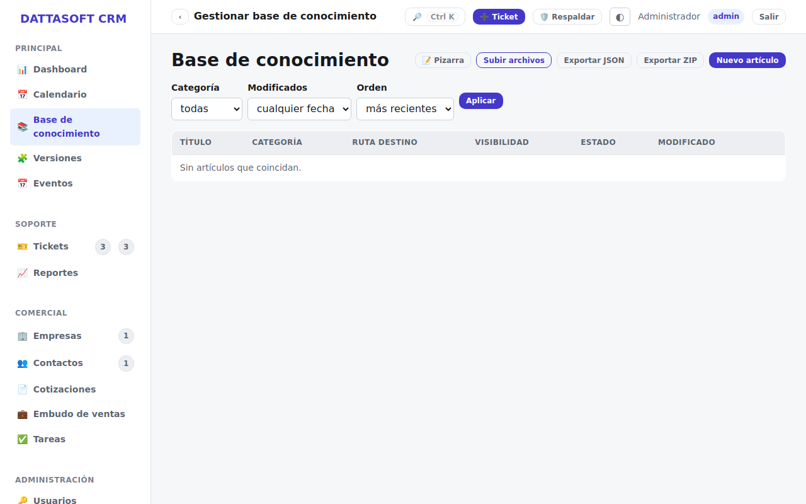
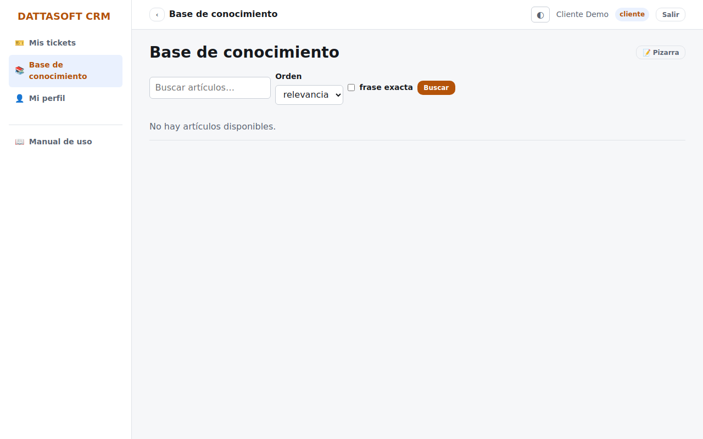

Artículos de ayuda escritos en Markdown, con tres niveles de visibilidad por artículo:
**staff** (solo equipo interno), **portal** (staff + clientes con cuenta) y **público**
(cualquiera, sin sesión, en `/kb`).

## Staff: escribir y publicar artículos

En `/app/kb` ves todos los artículos sin importar su visibilidad. *Nuevo artículo* pide
título (genera el slug automáticamente), categoría, cuerpo en Markdown, etiquetas y la
visibilidad. Un artículo no aparece fuera del back-office hasta que lo marcas **publicado**.

## Consultar artículos (staff, portal y público)

- Staff los ve en `/app/kb`.
- Un cliente logueado los ve en `/portal/kb` (solo los de visibilidad *portal* o *público*).
- Cualquier visitante los ve en `/kb`, sin sesión (solo los de visibilidad *público*).

En los tres casos el artículo se abre por su slug: `/kb/<slug>` (o el equivalente bajo
`/app` o `/portal`).
