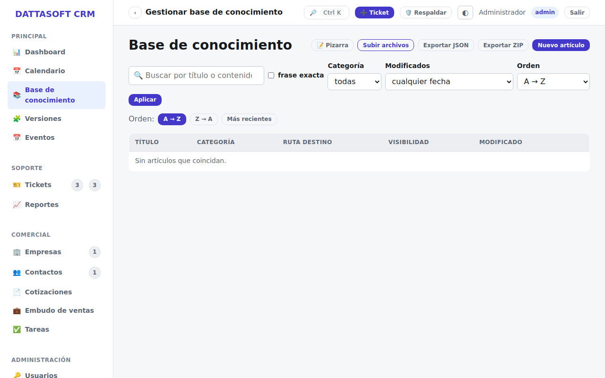

Los archivos de soporte del equipo, separados en dos carpetas igual que en Windows:
**🏢 Empresas** y **🛠 Soporte y licencias**. Son de **solo lectura**: se buscan, se leen y se
copian (📋 Copiar); nadie los edita en el CRM. El contenido solo cambia al **indexar** las
carpetas.

## Quién la ve

No depende del rol. El propietario (Erick) decide persona por persona en **👥 Acceso**: solo
quien tenga su casilla marcada la ve — un administrador sin marcar **no** la ve. Quien tiene
acceso solo busca, lee y copia; indexar, eliminar, exportar y dar acceso es exclusivo del
propietario. El cambio se aplica en menos de un minuto.

## Buscar

El buscador encuentra por **nombre** del archivo, **empresa o subcarpeta** (la ruta) y
**contenido** — incluidos números de versión como `14.2.1` —, sin importar mayúsculas ni
acentos. Cada resultado muestra el pedazo del contenido donde coincidió, resaltado. Con
**frase exacta** exige la frase completa. Las pestañas separan *Empresas* y *Soporte y
licencias* (con el conteo de resultados de cada una) y, dentro de una carpeta, puedes filtrar
por subcarpeta. Tus búsquedas recientes quedan abajo del buscador y se pueden borrar.

## Indexar (solo el propietario)

Arriba de la lista hay un botón **🔄 Indexar** por carpeta:

1. La primera vez te pide elegir la carpeta de Windows. El navegador (Chrome / Edge) la recuerda;
   desde entonces basta con el botón. 📂 sirve para elegir otra.
2. Compara cada archivo con lo ya indexado y sube **solo lo nuevo o modificado**. Un archivo se
   reconoce por su ruta dentro de la carpeta, así que reindexar nunca duplica (aunque renombres
   la carpeta raíz).
3. Si en el CRM hay archivos que ya no existen en la carpeta, lo avisa y ofrece
   **🗑️ Quitarlos del CRM**.

Solo se indexan archivos de texto (`.md`, `.txt`, `.ps1`, `.bat`, `.sql`…); imágenes y
ejecutables se ignoran. Los `.md` se muestran con formato; los scripts y `.txt`, tal cual. La
ruta de Windows de cada carpeta se anota en **👥 Acceso** como recordatorio (el navegador no
puede abrir una ruta escrita a mano).

## Respaldo

**💾 Respaldo ZIP** (solo el propietario) baja los archivos indexados con sus carpetas.
