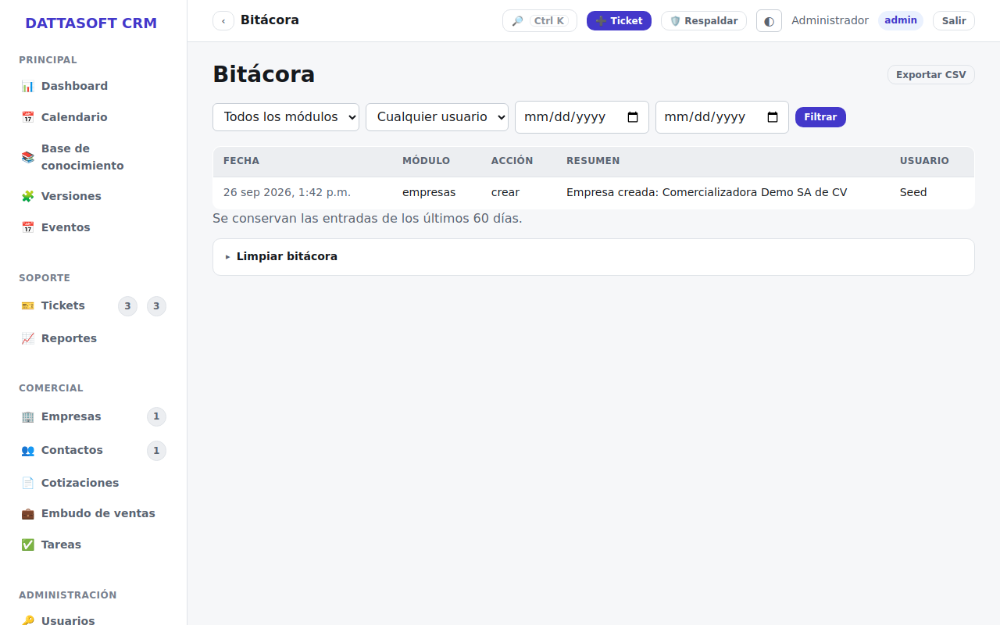

`/app/bitacora` es el registro de auditoría transversal del sistema: cada acción relevante
(crear/editar/archivar una empresa, aprobar una cotización, cambiar el estado de un ticket,
etc.) queda anotada aquí de forma automática — no se edita a mano.

## Qué muestra cada entrada

Fecha, quién hizo la acción, en qué módulo, sobre qué entidad y un resumen en texto plano.
Es de solo lectura: sirve para reconstruir "quién tocó qué y cuándo" ante una duda o un
reclamo, y para todos los roles con acceso es visible sin importar si tienen permiso de
edición en el módulo original.
