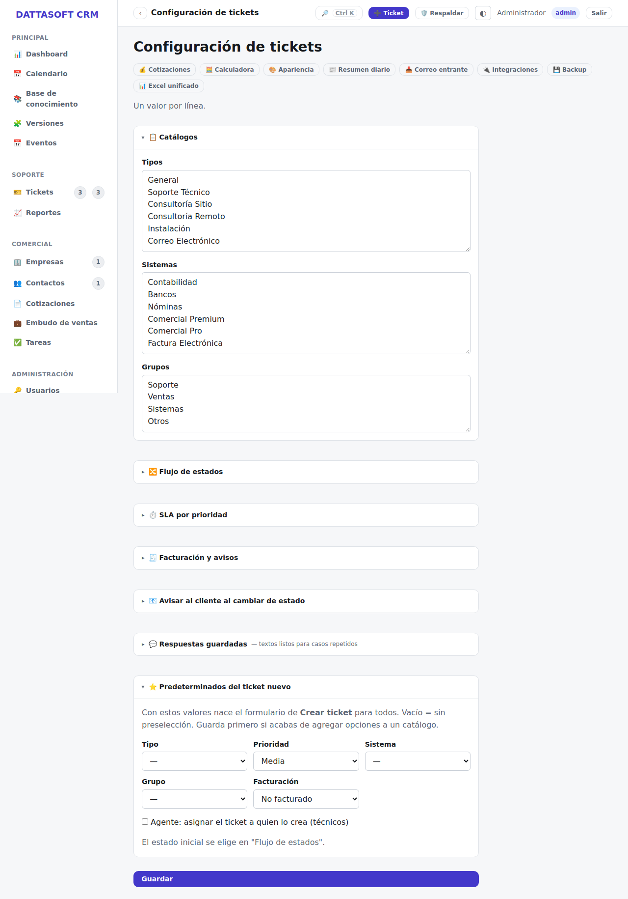

`/app/configuracion` reúne los catálogos y parámetros del sistema. Hoy la única sección con
UI es **Tickets** (`/app/configuracion/tickets`).

## Configuración de tickets

- **Catálogos**: tipos de ticket y prioridades disponibles al crear uno.
- **SLA**: tiempo de respuesta/resolución objetivo por prioridad.
- **Correos de notificación**: a qué direcciones internas se avisa de eventos de tickets
  (nuevo ticket, cambio de estado, etc.), además del correo al contacto del ticket.

## Otras configuraciones (sin UI dedicada aún)

Integraciones (Brevo, n8n, Turnstile) y la calculadora de licenciamiento Compac se ajustan
hoy por variables de entorno (`.env`) más que desde esta pantalla — ver
`docs/architecture/deploy.md` para el detalle de cada variable.
