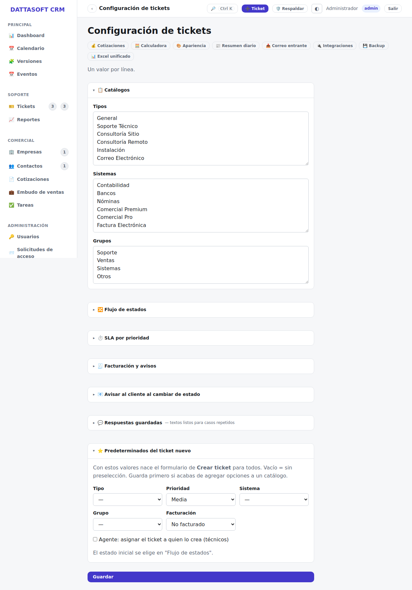

`/app/configuracion` reúne los catálogos y parámetros del sistema, repartidos en subpáginas
con botones arriba para saltar entre ellas.

## 🎫 Tickets

- **Catálogos**: tipos, sistemas, grupos, estados (y cuál es el inicial) y prioridades.
- **SLA**: horas máximas por prioridad; lo que las pase se marca en rojo.
- **Facturación y avisos**: tipos facturables, correos del equipo que reciben las
  notificaciones de tickets y en qué estados se le avisa al cliente del avance.
- **Respuestas rápidas** y **valores predeterminados** del formulario de ticket nuevo.

## 💰 Cotizaciones y 🧮 Calculadora

- **Cotizaciones**: condiciones por defecto, cargo/teléfono del emisor y el catálogo de
  conceptos rápidos que aparecen como sugerencia al capturar una cotización.
- **Calculadora Compac**: el catálogo de sistemas que se pueden marcar (agregar, quitar,
  reordenar), los **tipos de equipo** con su precio del *1er sistema* y del *adicional*, y el
  **precio de SQL**, que solo aplica a Servidor. Ver [Cotizaciones](cotizaciones.md).

## 🔌 Integraciones

Webhooks de n8n, WhatsApp del equipo (CallMeBot), WhatsApp a clientes y prueba de correo. La
**matriz de reglas** dice, evento por evento, si se manda al webhook, por WhatsApp y **a
quién del equipo** (sin nadie marcado le llega a todos). Eventos disponibles: ticket creado
por el equipo, ticket creado por el cliente, cambio de estado, nota interna, asignado,
resuelto, cerrado, facturado, cerrado y facturado, recordatorio de ticket programado,
cotización creada, empresa nueva, usuario nuevo y backup no realizado.

## 💾 Backup

- **Descargar backup completo (JSON)**; también desde el botón 🛡️ Respaldar de la barra
  superior. La página muestra la fecha del último backup y quién lo hizo.
- Si pasan **7 días o más** sin backup (o nunca se ha hecho), aparece un aviso aquí y en el
  Dashboard, y el cron manda el evento *backup no realizado* una vez al día.
- Restaurar un backup de ds-hd, importar el respaldo del CRM viejo y crear puntos de
  restauración en GitHub.

## Otras

- **🎨 Apariencia**: logo de la empresa y tema.
- **📰 Resumen diario**: correo automático con lo pendiente, a la hora indicada.
- **📥 Correo entrante**: buzón de Zoho del que se leen las respuestas de clientes.
- **📊 Excel unificado**: exportar/importar empresas, contactos y tickets.

La preferencia de **WhatsApp Web o app instalada** para los botones 💬 es de cada quien y se
elige en *Mi perfil* (se guarda en ese navegador).
