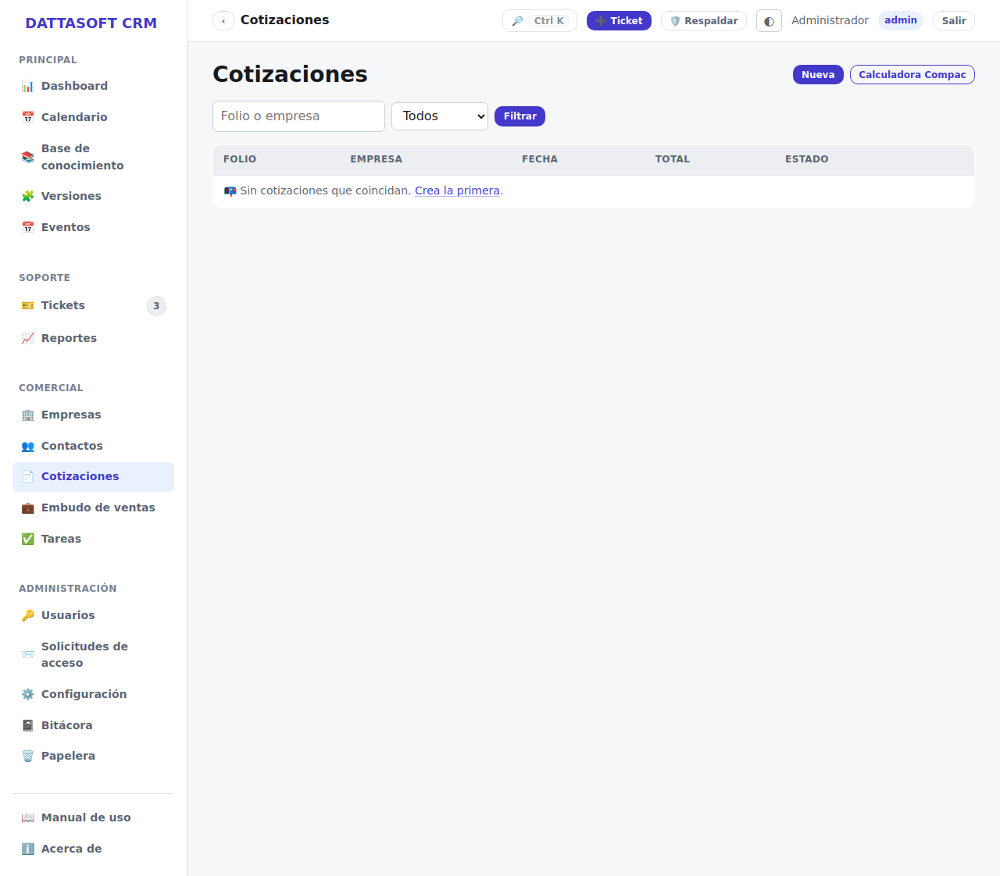
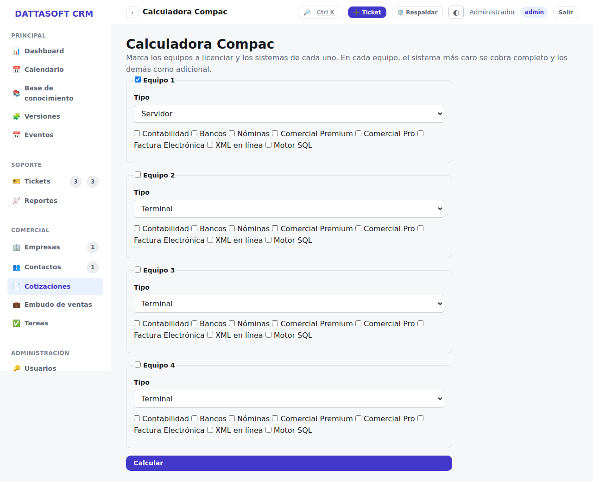

`/app/cotizaciones` administra cotizaciones formales para una empresa, con folio
consecutivo `COT-{año}-{n}`.

## Crear una cotización

*Cotizaciones → Nueva* (`/app/cotizaciones/nueva`): elige empresa y contacto, agrega
conceptos (uno o varios, cada uno con cantidad y precio) y el sistema calcula subtotal e
IVA. Cada cotización tiene una vigencia y un estado (borrador → enviada → aprobada/rechazada).

## Calculadora Compac

`/app/cotizaciones/calculadora` porta la lógica de licenciamiento CONTPAQi: dado un sistema
y un número de usuarios/licencias adicionales, calcula el precio aplicando la regla de
"primer usuario + adicionales" configurada en *Configuración*. El resultado se puede volcar
directo a una cotización nueva con **Usar en cotización**, sin volver a capturar los montos
a mano.

## Editar y cambiar estado

Desde el detalle de una cotización puedes editarla mientras siga en borrador, y cambiar su
estado a medida que avanza con el cliente (enviada, aprobada, rechazada). Aprobar una
cotización queda registrado en la [Bitácora](bitacora.md).
