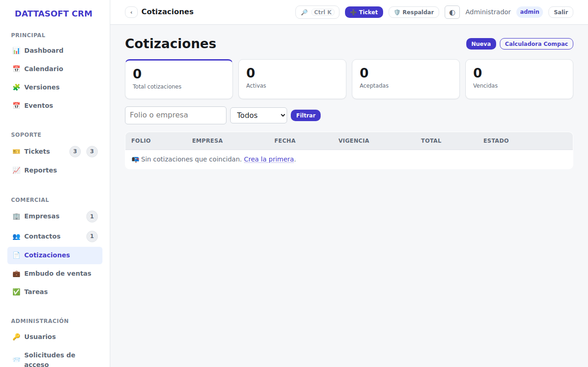
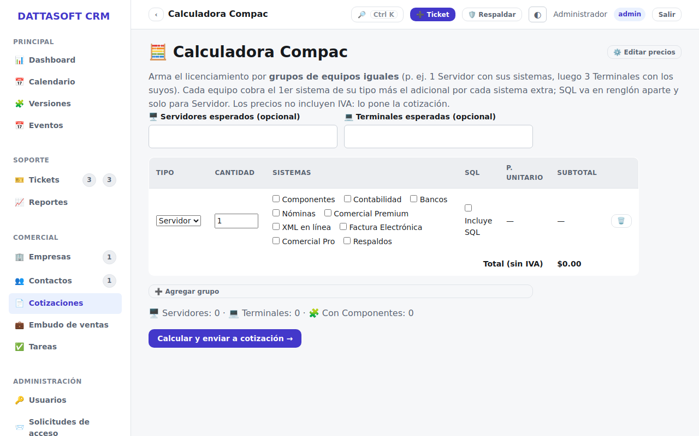

`/app/cotizaciones` administra cotizaciones formales para una empresa, con folio
consecutivo `COT-{año}-{n}`.

## Crear una cotización

*Cotizaciones → Nueva* (`/app/cotizaciones/nueva`): elige empresa y contacto, agrega
conceptos (uno o varios, cada uno con cantidad y precio) y el sistema calcula subtotal e
IVA. Cada cotización tiene una vigencia y un estado (borrador → enviada → aprobada/rechazada).

## Calculadora Compac

`/app/cotizaciones/calculadora` arma el licenciamiento CONTPAQi por **grupos de equipos
iguales**: tipo de equipo (Servidor, Terminal…), cantidad, los sistemas que llevan y, en
Servidor, si incluyen SQL. Cada equipo cobra el precio del *1er sistema* de su tipo más el
*adicional* por cada sistema extra; SQL va en un renglón aparte. El desglose se calcula en
vivo, con el conteo de servidores/terminales y un aviso si no coincide con lo que esperabas.

Al terminar, **Enviar a una cotización nueva** abre el formulario con los renglones ya
capturados (se pueden editar antes de guardar). Los precios se cambian en
*Configuración → Calculadora* (botón ⚙️ Editar precios).

## Editar y cambiar estado

Desde el detalle de una cotización puedes editarla mientras siga en borrador, y cambiar su
estado a medida que avanza con el cliente (enviada, aprobada, rechazada). Aprobar una
cotización queda registrado en la [Bitácora](bitacora.md).
