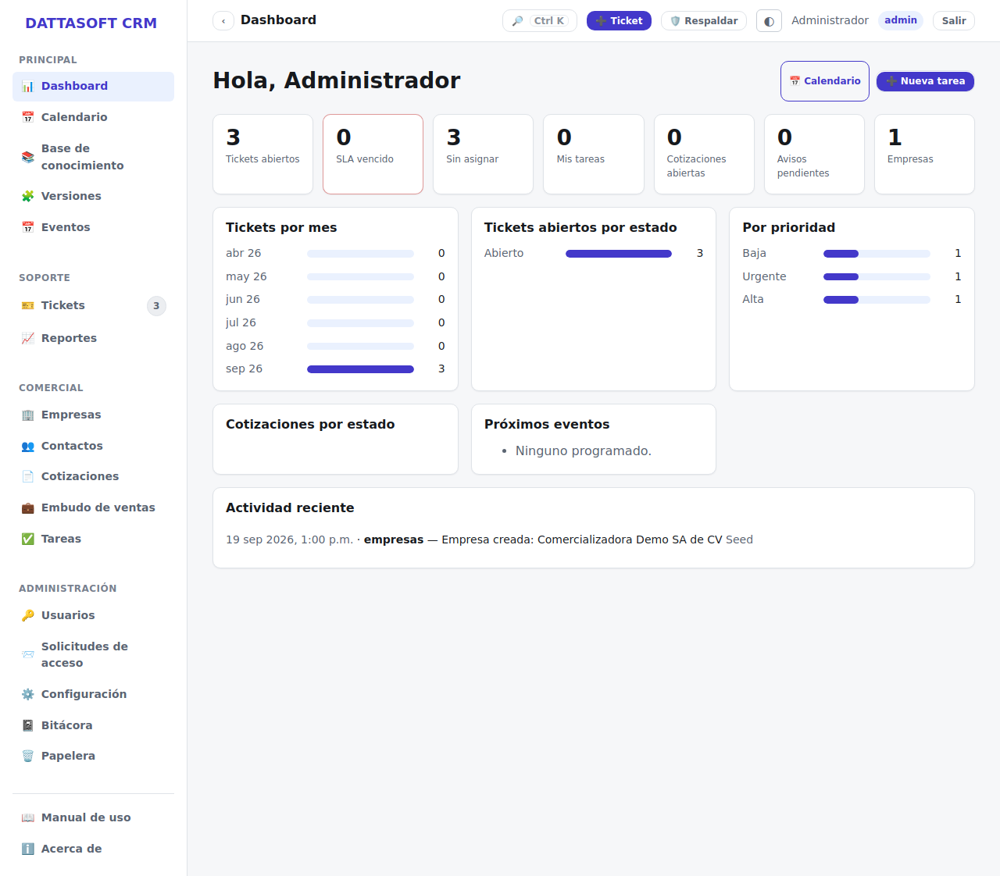

Al entrar al back-office (`/app`) llegas al panel principal, con métricas acotadas a lo que
tu rol puede ver (un agente solo ve lo suyo; admin/supervisor/lectura ven el global).

## Qué muestra

- **Tickets**: abiertos, pendientes, resueltos en el periodo, y los que están por vencer o
  vencidos de SLA.
- **Cotizaciones**: cuántas están en borrador, enviadas y aprobadas.
- **Eventos**: próximos webinars y su cupo/inscritos.
- **Actividad reciente**: últimas entradas de la bitácora relevantes a tu rol.

Las barras y totales se recalculan en cada carga de la página; no hay botón de "actualizar"
porque no cachea nada.

## Para qué sirve

Es el punto de partida del día: de un vistazo ves si hay tickets urgentes sin atender o
vencidos, y saltas a *Tickets* o a tu panel de *Mis asignados* desde el menú lateral.
