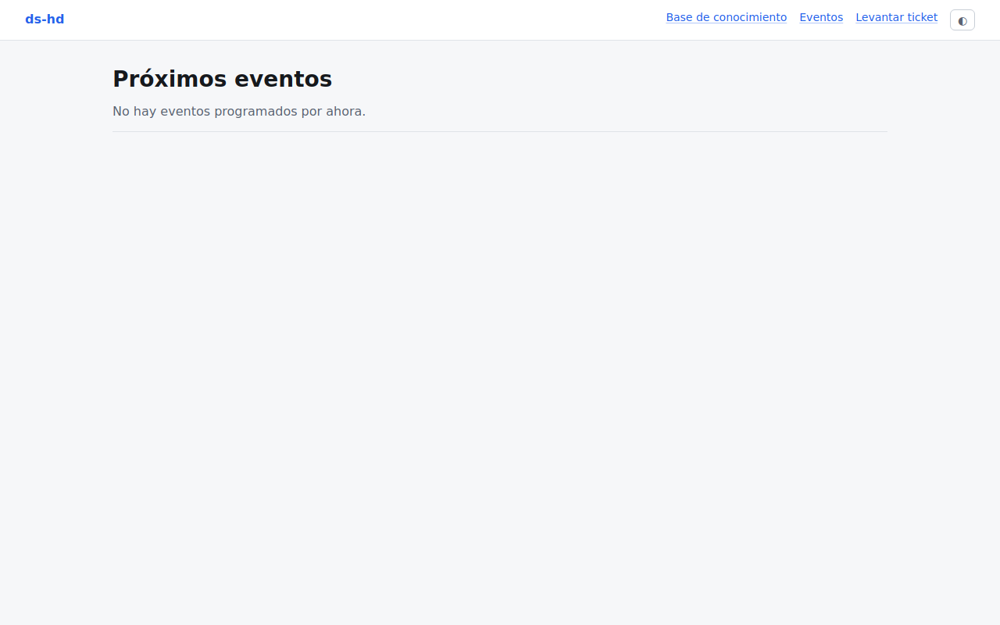

`/eventos` lista los próximos webinars y eventos abiertos al público, sin necesidad de
cuenta.

## Registrarte

Entra al evento que te interesa y llena el formulario: nombre, correo, teléfono (opcional)
y empresa (opcional). Incluye una verificación anti-robots. Si el evento ya llegó a su
cupo máximo, el formulario de registro no estará disponible.

## Después de registrarte

Recibes un correo de confirmación con los detalles del evento, y otro de recordatorio
cerca de la fecha. Si necesitas cancelar tu registro o cambiar tus datos, responde a ese
correo para que el equipo lo ajuste manualmente.
