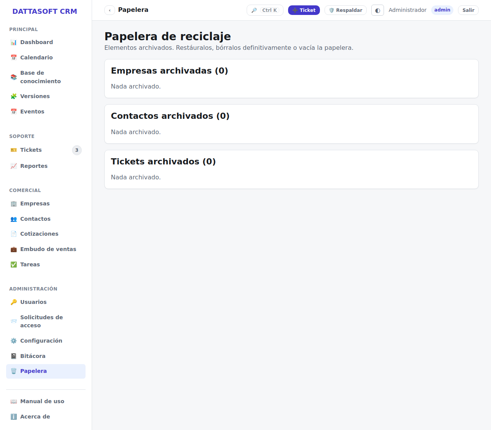

`/app/papelera` reúne las empresas y contactos que alguien archivó desde su pantalla de
detalle (botón **Archivar**), en vez de borrarlos.

## Restaurar

Cada elemento archivado tiene un botón **Restaurar** que lo regresa a su listado normal
(*Empresas* o *Contactos*) tal cual estaba, sin perder su historial ni sus relaciones (una
empresa restaurada conserva sus contactos, tickets y cotizaciones).

No hay borrado permanente desde la UI — es una papelera, no una eliminación irreversible.
