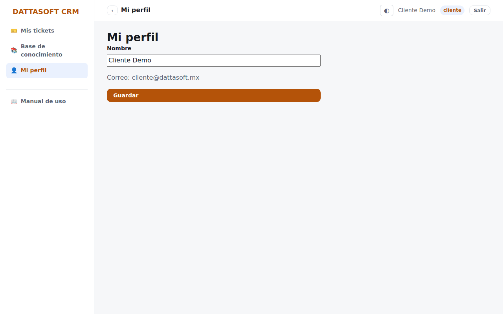

`/portal/perfil` muestra tus datos de cuenta: nombre, correo y la empresa a la que estás
vinculado.

Hoy puedes editar tu **nombre** desde aquí. Si necesitas cambiar el correo con el que
inicias sesión, tu contraseña o la empresa a la que estás vinculado, pide a tu contacto de
soporte que lo haga desde el módulo de Usuarios — no es autoservicio todavía.
