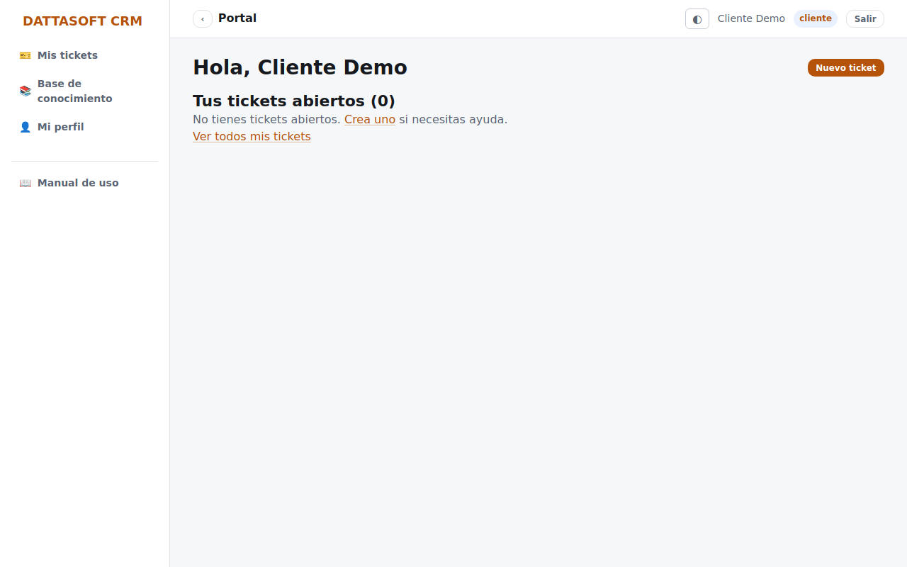
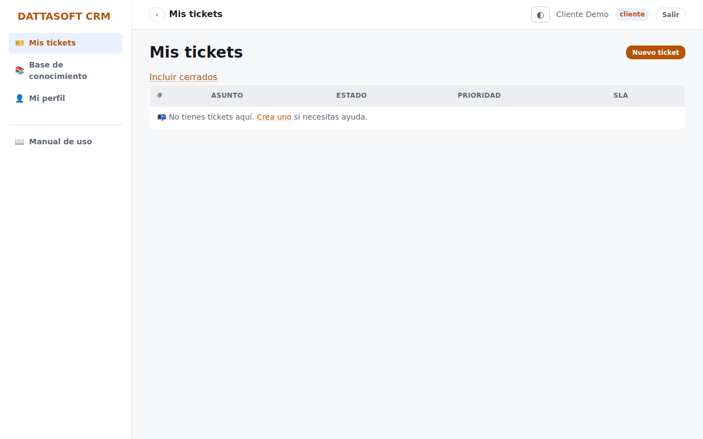
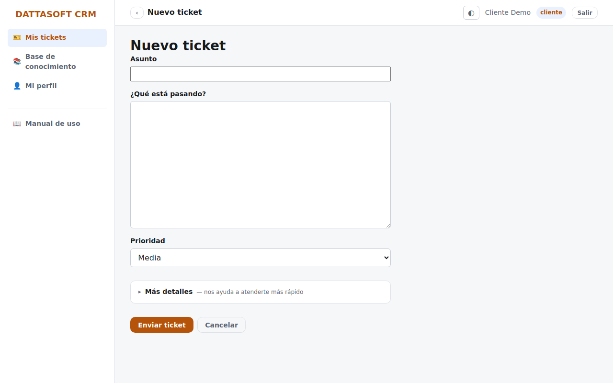

Al entrar con tu cuenta de cliente llegas a `/portal`, tu panel personal.

## Ver tus tickets

*Mis tickets* (`/portal/tickets`) lista únicamente los tickets que tú (o alguien de tu
empresa a través tuyo) ha abierto — nunca ves tickets de otros clientes.

Abre uno para ver su estado, su historial de cambios de estado y las notas **públicas** que
el equipo de soporte haya dejado. Las notas internas del staff nunca aparecen aquí.

## Crear un ticket nuevo

*Mis tickets → Nuevo ticket* (`/portal/tickets/nuevo`).

Describe tu problema (asunto, descripción, tipo). El ticket queda ligado automáticamente a
tu cuenta y a tu empresa; no necesitas indicar datos de contacto porque ya se conocen de tu
perfil.

## Responder un ticket

Desde el detalle del ticket, el cuadro de **Responder** agrega un mensaje tuyo al hilo; el
equipo de soporte lo ve y puede contestarte por ahí mismo o por correo, según cómo esté
configurada la notificación.
