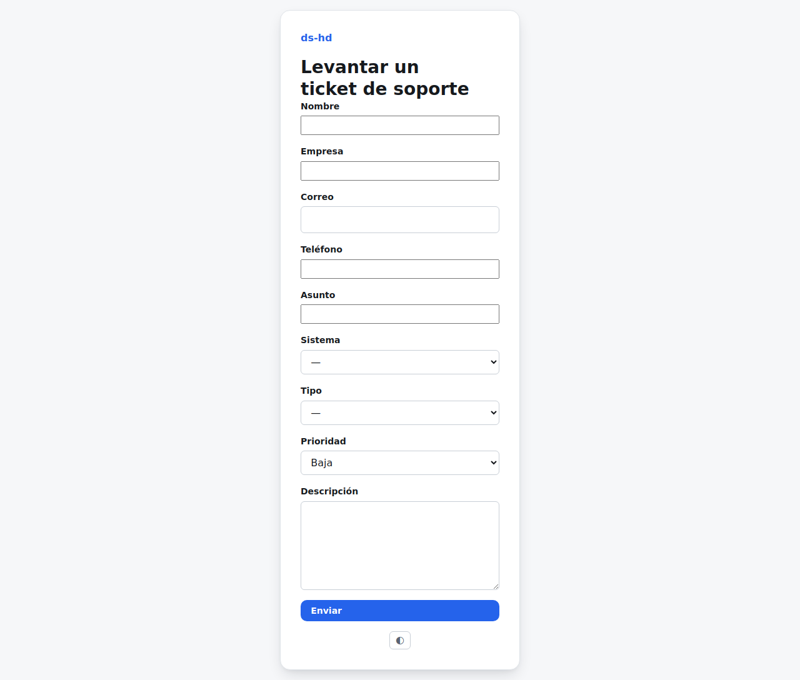

Si todavía no tienes una cuenta de portal, puedes reportar un problema sin iniciar sesión
desde `/ticket-publico`.

## Qué necesitas llenar

Nombre, empresa, correo, teléfono (opcional), asunto, sistema afectado, tipo, prioridad y
una descripción del problema. El formulario incluye una verificación anti-robots.

## Qué pasa después de enviarlo

Tu solicitud no se convierte en ticket de inmediato: llega primero al buzón interno del
equipo de soporte, quien la revisa y **acepta** (creando el ticket formal, con folio y
seguimiento de tiempos) o la **rechaza** si no procede. Te avisan por correo en cuanto se
acepta.

Si prefieres poder ver el estado de tus tickets y su historial en cualquier momento, pide
al equipo de soporte que te invite al portal de clientes (ver
[Iniciar sesión y solicitar acceso](login-y-acceso.md)).
