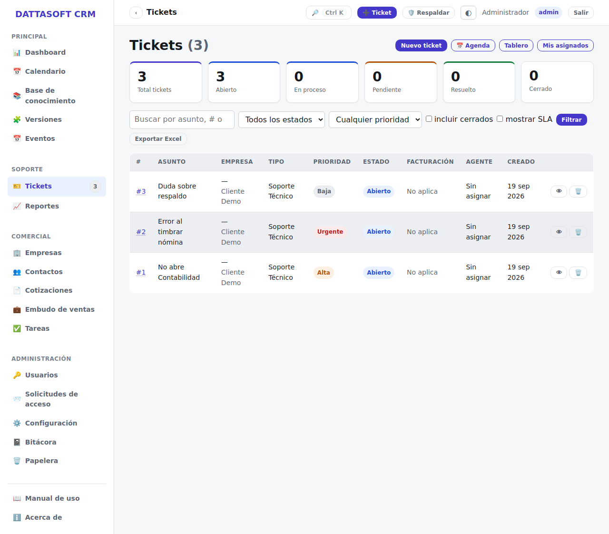
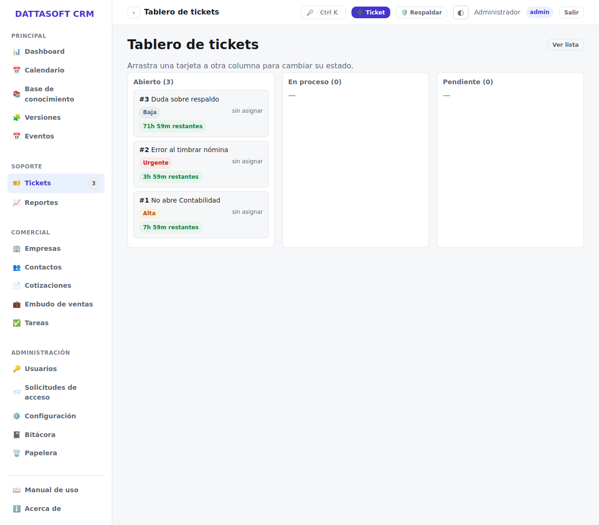

El módulo de tickets (`/app/tickets`) es el corazón del sistema de soporte.

## Vistas disponibles

| Vista | Ruta | Para qué |
| --- | --- | --- |
| Lista | `/app/tickets` | filtrar/ordenar todos los tickets que puedes ver |
| Tablero (kanban) | `/app/tickets/tablero` | arrastrar un ticket entre columnas para cambiar su estado |
| Mis asignados | `/app/tickets/mis-asignados` | los tickets asignados a ti (agente) |
| Carga de agentes | `/app/tickets/carga-agentes` | cuántos tickets abiertos tiene cada agente frente a su capacidad máxima (requiere permiso de asignar) |
| Buzón público | `/app/tickets/buzon` | tickets creados desde el formulario público, pendientes de aceptar o rechazar |

## Ciclo de vida de un ticket

Estados, en orden: **Abierto → En proceso → Pendiente → Resuelto → Cerrado**. El tiempo
trabajado solo corre mientras el ticket está en un estado que no sea "Pendiente"; el SLA se
pausa exactamente en ese mismo estado. Cambiar el estado se hace desde el detalle del
ticket o arrastrando su tarjeta en el tablero.

## Crear un ticket (interno)

*Tickets → Nuevo* (`/app/tickets/nuevo`). Requiere asunto, descripción, tipo y prioridad;
opcionalmente lo ligas a una empresa/contacto existentes. Al guardar, el sistema le asigna
un folio consecutivo y calcula su fecha de vencimiento de SLA según la prioridad.

## Buzón de tickets públicos

Cuando alguien externo crea un ticket desde `/ticket-publico` (sin cuenta), cae primero en
el buzón (`/app/tickets/buzon`) y **no** es un ticket real todavía. Desde ahí:

- **Aceptar**: lo convierte en un ticket normal (folio, SLA, todo).
- **Rechazar**: lo descarta sin crear ticket.

## Asignar y trabajar un ticket

Desde el detalle: **Asignar** elige un agente (respeta su `capacidadMax`, salvo que fuerces
la asignación); **Cambiar estado** avanza el ciclo de vida; **Agregar nota** deja constancia
del trabajo — marca la nota como **pública** (la ve el cliente en su portal) o **interna**
(solo staff). Al cerrar puedes marcarlo para **facturar**.

## Panel de carga de agentes

Muestra, por agente, cuántos tickets abiertos tiene contra su capacidad máxima configurada
en su perfil (*Usuarios*) — útil para decidir a quién asignar el siguiente ticket sin
saturar a nadie.
