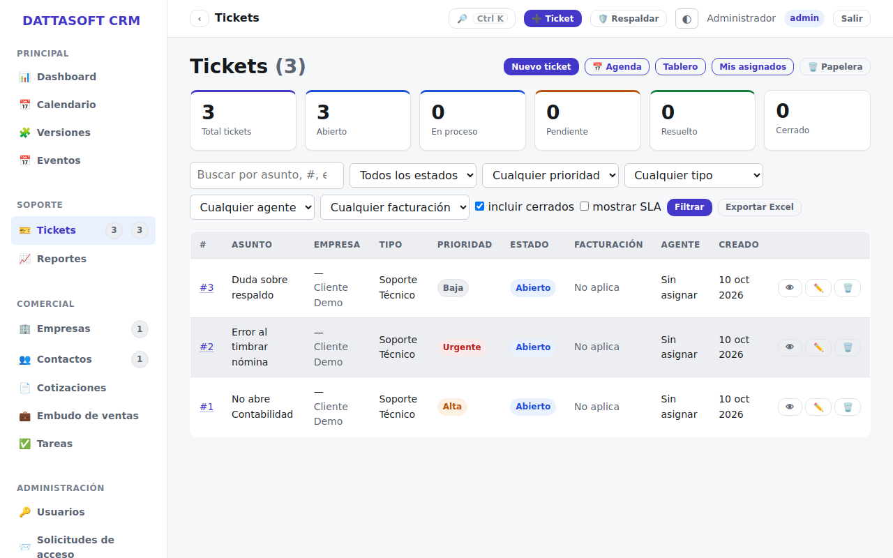
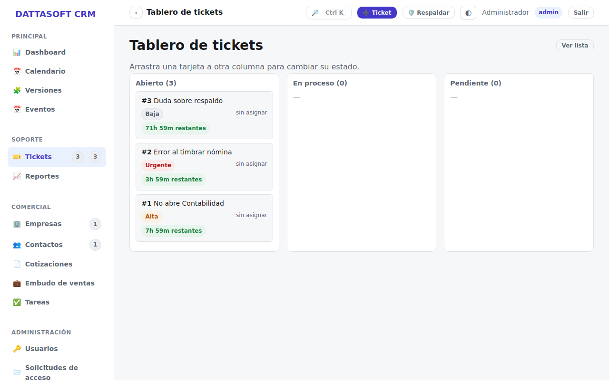

El módulo de tickets (`/app/tickets`) es el corazón del sistema de soporte.

## Vistas disponibles

| Vista | Ruta | Para qué |
| --- | --- | --- |
| Lista | `/app/tickets` | filtrar/ordenar todos los tickets que puedes ver |
| Tablero (kanban) | `/app/tickets/tablero` | arrastrar un ticket entre columnas para cambiar su estado |
| Mis asignados | `/app/tickets/mis-asignados` | los tickets asignados a ti (agente) |
| Carga de agentes | `/app/tickets/carga-agentes` | cuántos tickets abiertos tiene cada agente frente a su capacidad máxima (requiere permiso de asignar) |
| Solicitudes de ticket | `/app/tickets/buzon` | solicitudes del formulario público o de un correo sin número de ticket, pendientes de convertir o descartar |

## Ciclo de vida de un ticket

Estados, en orden: **Abierto → En proceso → Pendiente → Resuelto → Cerrado**. El tiempo
trabajado solo corre mientras el ticket está en un estado que no sea "Pendiente"; el SLA se
pausa exactamente en ese mismo estado. Cambiar el estado se hace desde el detalle del
ticket o arrastrando su tarjeta en el tablero.

## Crear un ticket (interno)

*Tickets → Nuevo* (`/app/tickets/nuevo`). Requiere asunto, descripción, tipo y prioridad;
opcionalmente lo ligas a una empresa/contacto existentes. Al guardar, el sistema le asigna
un folio consecutivo y calcula su fecha de vencimiento de SLA según la prioridad.

## Solicitudes de ticket (formulario público y correo)

Cuando alguien externo crea un ticket desde `/ticket-publico` (sin cuenta), o manda un correo
que no trae número de ticket en el asunto, cae primero en *Solicitudes de ticket*
(`/app/tickets/buzon`) y **no** es un ticket real todavía. Arriba de la lista de tickets sale un
aviso con cuántas esperan. Desde ahí:

- **🎫 Convertir a ticket**: lo vuelve un ticket normal (folio, SLA, todo); las imágenes pasan a adjuntos.
- **🗑️ Descartar**: lo quita sin crear ticket.

## Conversación por correo

En el detalle del ticket, **💬 Conversación** muestra lo más reciente arriba: en verde lo que
llegó por correo y en azul lo que se mandó desde el CRM. La caja de respuesta manda el mensaje
por correo al cliente (con *Con copia* opcional y hasta 5 capturas, que también puedes pegar con
Ctrl+V). Todos los correos de un ticket llevan `[Ticket #N]` en el asunto: cuando el cliente o un
agente en copia contesta, su respuesta (con sus capturas) aparece sola en la conversación y queda
en la actividad del ticket y en la Bitácora. Se configura en *Configuración → Correo entrante*.

## Quién ve qué ticket

Administradores, supervisores y lectura ven todos. Un agente (o soporte) ve los suyos —por
**Agente** o por **Canalizado a**, aunque el nombre esté corto ("DIEGO") o completo— más los que
nadie tiene asignados todavía, para que no queden invisibles. El filtro *Agente* de la lista busca
igual, en los dos campos.

## Asignar y trabajar un ticket

Desde el detalle: **Asignar** elige un agente (respeta su `capacidadMax`, salvo que fuerces
la asignación); **Cambiar estado** avanza el ciclo de vida; **Agregar nota** deja constancia
del trabajo — marca la nota como **pública** (la ve el cliente en su portal) o **interna**
(solo staff). Al cerrar puedes marcarlo para **facturar**.

## Adjuntos

En el detalle del ticket se suben imágenes, PDF y XML (o se pega una imagen con Ctrl+V). El
botón 📍/📌 marca un adjunto como **permanente**: mientras lo esté no se puede quitar y el
mantenimiento de adjuntos de *Configuración → Backup* no lo toca.

## Panel de carga de agentes

Muestra, por agente, cuántos tickets abiertos tiene contra su capacidad máxima configurada
en su perfil (*Usuarios*) — útil para decidir a quién asignar el siguiente ticket sin
saturar a nadie.
