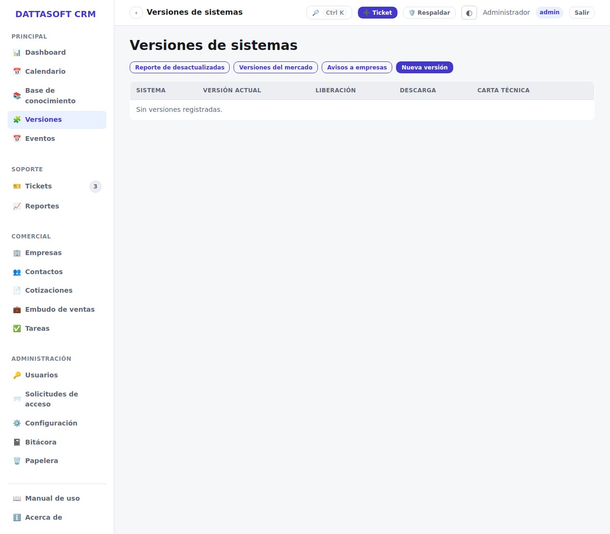

`/app/versiones` lleva el catálogo de versiones disponibles de cada sistema CONTPAQi
(Contabilidad, Nóminas, Bancos, etc.): versión actual, fecha de liberación, notas de la
versión y el link de descarga.

## Para qué sirve

Es la referencia que usa soporte para confirmar si un cliente está desactualizado (comparando
contra `sistemasContratados` de su empresa) y para dirigirlo al instalador correcto. Se edita
desde *Versiones → Nueva* o abriendo un sistema existente; **Eliminar** quita la entrada del
catálogo (no afecta empresas que ya tengan ese sistema contratado).
