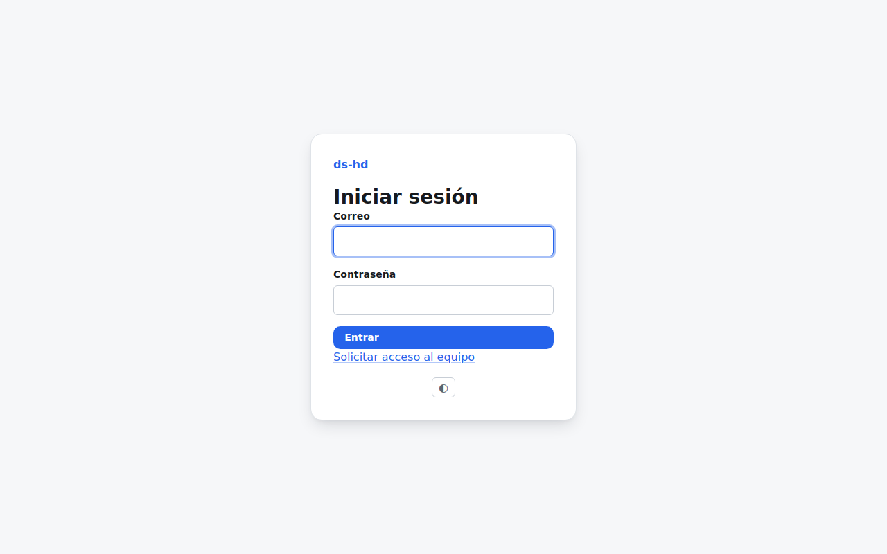
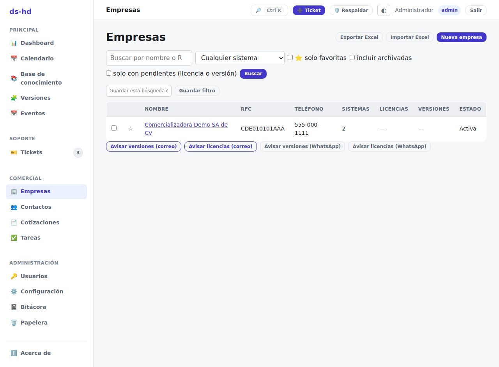
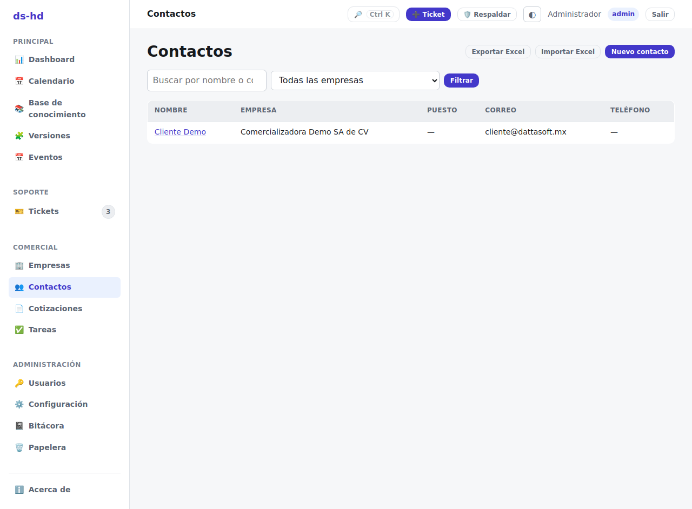
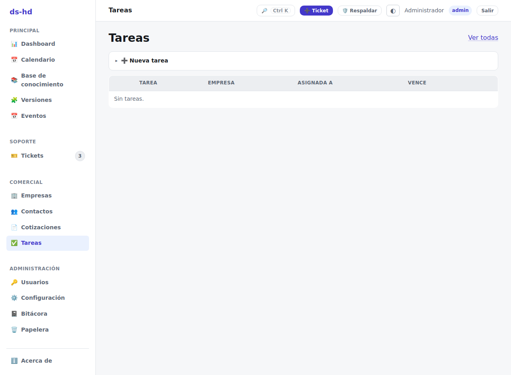
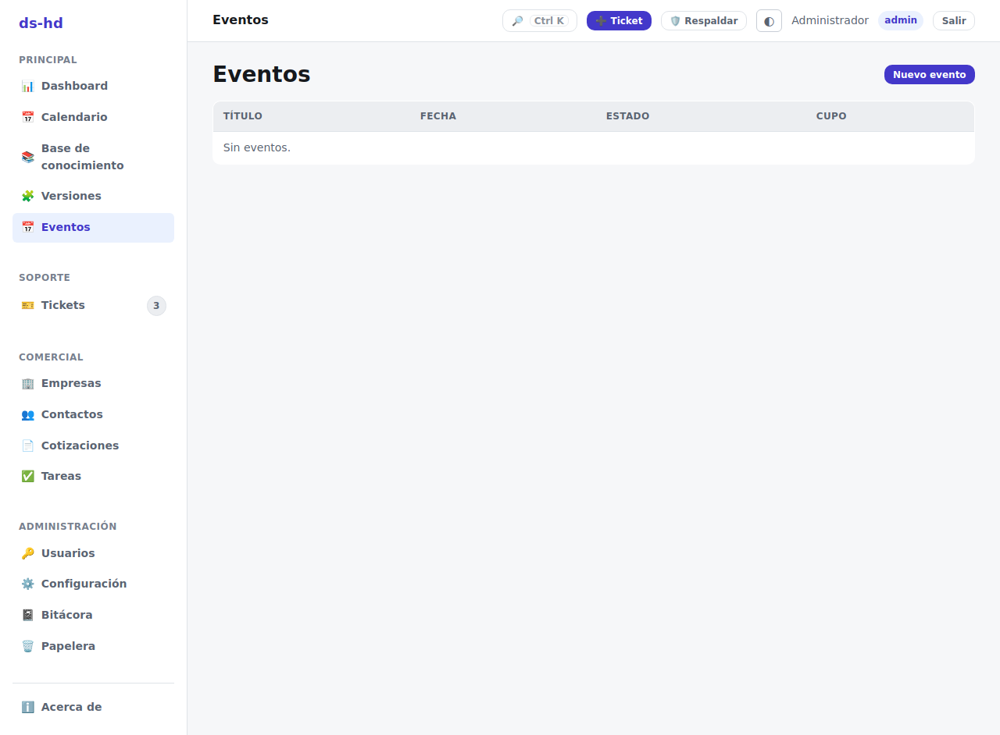
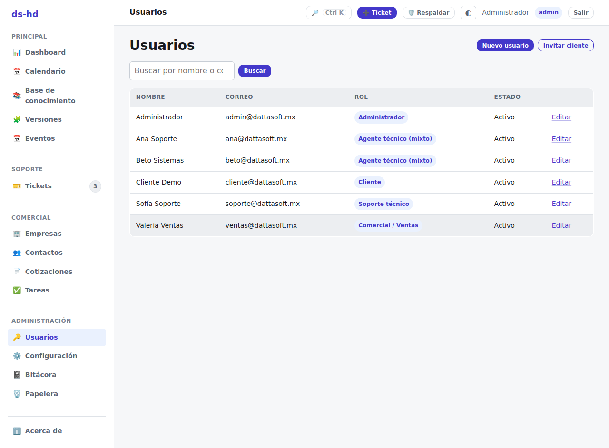

# Manual de staff — ds-hd

> Generado automáticamente por `npm run docs:manuals` desde `docs/manual/_sources/`. No editar a mano.

## Contenido

1. [Iniciar sesión y solicitar acceso](#iniciar-sesion-y-solicitar-acceso)
2. [Panel principal (dashboard)](#panel-principal-dashboard)
3. [Tickets y agentes técnicos](#tickets-y-agentes-tecnicos)
4. [Empresas y contactos](#empresas-y-contactos)
5. [Cotizaciones y Calculadora Compac](#cotizaciones-y-calculadora-compac)
6. [Versiones de sistemas](#versiones-de-sistemas)
7. [Base de conocimiento](#base-de-conocimiento)
8. [Seguimiento comercial (tareas e interacciones)](#seguimiento-comercial-tareas-e-interacciones)
9. [Papelera de reciclaje](#papelera-de-reciclaje)
10. [Bitácora de auditoría](#bitacora-de-auditoria)
11. [Eventos y webinars (gestión)](#eventos-y-webinars-gestion)
12. [Usuarios, roles y permisos](#usuarios-roles-y-permisos)
13. [Configuración](#configuracion)

---

## Iniciar sesión y solicitar acceso

Todo el sistema vive detrás de una sola pantalla de inicio de sesión en `/login`.

## Iniciar sesión

1. Entra a la URL de la app (por ejemplo `https://soporte.dattasoft.mx`); si no tienes
   sesión, te redirige a `/login`.
2. Escribe tu correo y contraseña y pulsa **Entrar**.
3. Según tu rol, caerás en el back-office (`/app`) si eres staff (admin, supervisor, agente
   o lectura), o en tu portal (`/portal`) si eres cliente.

Si tu cuenta está desactivada o la contraseña es incorrecta, verás un aviso en rojo arriba
del formulario y podrás intentarlo de nuevo.

## No tengo cuenta todavía

- **Staff nuevo**: pide a un administrador que te dé de alta desde
  *Usuarios → Nuevo usuario* (ver [Usuarios y permisos](usuarios-y-permisos.md)), o entra a
  `/solicitar-acceso` y llena el formulario; un administrador recibirá tu solicitud por
  correo y decidirá si te da de alta.
- **Cliente nuevo**: no te registras tú mismo. El equipo de soporte te invita desde el
  módulo de Usuarios (*Invitar cliente*); recibirás un correo con un enlace de un solo uso
  para fijar tu contraseña. El enlace vence a las 72 horas; si expira, pide que te reenvíen
  la invitación.

## Cerrar sesión

Usa el enlace **Salir** del menú superior en cualquier pantalla, o entra a `/logout`.

---

## Panel principal (dashboard)

Al entrar al back-office (`/app`) llegas al panel principal, con métricas acotadas a lo que
tu rol puede ver (un agente solo ve lo suyo; admin/supervisor/lectura ven el global).

## Qué muestra

- **Tickets**: abiertos, pendientes, resueltos en el periodo, y los que están por vencer o
  vencidos de SLA.
- **Cotizaciones**: cuántas están en borrador, enviadas y aprobadas.
- **Eventos**: próximos webinars y su cupo/inscritos.
- **Actividad reciente**: últimas entradas de la bitácora relevantes a tu rol.

Las barras y totales se recalculan en cada carga de la página; no hay botón de "actualizar"
porque no cachea nada.

## Para qué sirve

Es el punto de partida del día: de un vistazo ves si hay tickets urgentes sin atender o
vencidos, y saltas a *Tickets* o a tu panel de *Mis asignados* desde el menú lateral.

---

## Tickets y agentes técnicos

El módulo de tickets (`/app/tickets`) es el corazón del sistema de soporte.

## Vistas disponibles

| Vista | Ruta | Para qué |
| --- | --- | --- |
| Lista | `/app/tickets` | filtrar/ordenar todos los tickets que puedes ver |
| Tablero (kanban) | `/app/tickets/tablero` | arrastrar un ticket entre columnas para cambiar su estado |
| Mis asignados | `/app/tickets/mis-asignados` | los tickets asignados a ti (agente) |
| Carga de agentes | `/app/tickets/carga-agentes` | cuántos tickets abiertos tiene cada agente frente a su capacidad máxima (requiere permiso de asignar) |
| Buzón público | `/app/tickets/buzon` | tickets creados desde el formulario público, pendientes de aceptar o rechazar |

## Ciclo de vida de un ticket

Estados, en orden: **Abierto → En proceso → Pendiente → Resuelto → Cerrado**. El tiempo
trabajado solo corre mientras el ticket está en un estado que no sea "Pendiente"; el SLA se
pausa exactamente en ese mismo estado. Cambiar el estado se hace desde el detalle del
ticket o arrastrando su tarjeta en el tablero.

## Crear un ticket (interno)

*Tickets → Nuevo* (`/app/tickets/nuevo`). Requiere asunto, descripción, tipo y prioridad;
opcionalmente lo ligas a una empresa/contacto existentes. Al guardar, el sistema le asigna
un folio consecutivo y calcula su fecha de vencimiento de SLA según la prioridad.

## Buzón de tickets públicos

Cuando alguien externo crea un ticket desde `/ticket-publico` (sin cuenta), cae primero en
el buzón (`/app/tickets/buzon`) y **no** es un ticket real todavía. Desde ahí:

- **Aceptar**: lo convierte en un ticket normal (folio, SLA, todo).
- **Rechazar**: lo descarta sin crear ticket.

## Asignar y trabajar un ticket

Desde el detalle: **Asignar** elige un agente (respeta su `capacidadMax`, salvo que fuerces
la asignación); **Cambiar estado** avanza el ciclo de vida; **Agregar nota** deja constancia
del trabajo — marca la nota como **pública** (la ve el cliente en su portal) o **interna**
(solo staff). Al cerrar puedes marcarlo para **facturar**.

## Panel de carga de agentes

Muestra, por agente, cuántos tickets abiertos tiene contra su capacidad máxima configurada
en su perfil (*Usuarios*) — útil para decidir a quién asignar el siguiente ticket sin
saturar a nadie.

---

## Empresas y contactos

Empresas (`/app/empresas`) y contactos (`/app/contactos`) son el directorio de clientes del
CRM; casi todo lo demás (tickets, cotizaciones, seguimiento) se liga a una empresa.

## Empresas

Una empresa guarda RFC, razón social, datos de contacto, los **sistemas contratados**
(p. ej. CONTPAQi Contabilidad, Nóminas) y sus **vigencias** de licencia por sistema.

- **Nueva empresa** (`/app/empresas/nueva`): el nombre debe ser único.
- **Ver / Editar**: desde el detalle también ves sus contactos, tickets e interacciones
  comerciales ligadas.
- **Archivar**: no borra la empresa; la manda a la [Papelera](papelera.md), de donde se
  puede restaurar.

## Contactos

Cada contacto pertenece a una empresa (`empresaId` obligatorio). Un contacto marcado como
**de portal** (`esPortal`) es el que tiene o puede tener una cuenta de cliente vinculada —
eso se configura al invitarlo desde [Usuarios y permisos](usuarios-y-permisos.md), no desde
aquí directamente.

- **Nuevo contacto** (`/app/contactos/nuevo`): elige la empresa a la que pertenece.
- **Archivar**: igual que empresas, va a la papelera y es reversible.

---

## Cotizaciones y Calculadora Compac

`/app/cotizaciones` administra cotizaciones formales para una empresa, con folio
consecutivo `COT-{año}-{n}`.

## Crear una cotización

*Cotizaciones → Nueva* (`/app/cotizaciones/nueva`): elige empresa y contacto, agrega
conceptos (uno o varios, cada uno con cantidad y precio) y el sistema calcula subtotal e
IVA. Cada cotización tiene una vigencia y un estado (borrador → enviada → aprobada/rechazada).

## Calculadora Compac

`/app/cotizaciones/calculadora` porta la lógica de licenciamiento CONTPAQi: dado un sistema
y un número de usuarios/licencias adicionales, calcula el precio aplicando la regla de
"primer usuario + adicionales" configurada en *Configuración*. El resultado se puede volcar
directo a una cotización nueva con **Usar en cotización**, sin volver a capturar los montos
a mano.

## Editar y cambiar estado

Desde el detalle de una cotización puedes editarla mientras siga en borrador, y cambiar su
estado a medida que avanza con el cliente (enviada, aprobada, rechazada). Aprobar una
cotización queda registrado en la [Bitácora](bitacora.md).

---

## Versiones de sistemas

`/app/versiones` lleva el catálogo de versiones disponibles de cada sistema CONTPAQi
(Contabilidad, Nóminas, Bancos, etc.): versión actual, fecha de liberación, notas de la
versión y el link de descarga.

## Para qué sirve

Es la referencia que usa soporte para confirmar si un cliente está desactualizado (comparando
contra `sistemasContratados` de su empresa) y para dirigirlo al instalador correcto. Se edita
desde *Versiones → Nueva* o abriendo un sistema existente; **Eliminar** quita la entrada del
catálogo (no afecta empresas que ya tengan ese sistema contratado).

---

## Base de conocimiento

Artículos de ayuda escritos en Markdown, con tres niveles de visibilidad por artículo:
**staff** (solo equipo interno), **portal** (staff + clientes con cuenta) y **público**
(cualquiera, sin sesión, en `/kb`).

## Staff: escribir y publicar artículos

En `/app/kb` ves todos los artículos sin importar su visibilidad. *Nuevo artículo* pide
título (genera el slug automáticamente), categoría, cuerpo en Markdown, etiquetas y la
visibilidad. Un artículo no aparece fuera del back-office hasta que lo marcas **publicado**.

## Consultar artículos (staff, portal y público)

- Staff los ve en `/app/kb`.
- Un cliente logueado los ve en `/portal/kb` (solo los de visibilidad *portal* o *público*).
- Cualquier visitante los ve en `/kb`, sin sesión (solo los de visibilidad *público*).

En los tres casos el artículo se abre por su slug: `/kb/<slug>` (o el equivalente bajo
`/app` o `/portal`).

---

## Seguimiento comercial (tareas e interacciones)

`/app/tareas` lleva el seguimiento comercial: **tareas** asignables (llamar al cliente,
enviar propuesta, dar seguimiento a una cotización) e **interacciones** (bitácora de
contacto con una empresa: llamada, correo, visita).

## Tareas

Cada tarea tiene un responsable, una fecha límite y una empresa (opcional). Se crean desde
*Tareas → Nueva* o desde el detalle de una empresa. **Marcar** una tarea la da por
completada; sigue visible en el historial pero deja de contar como pendiente.

## Interacciones

Se registran desde el detalle de una empresa (*Registrar interacción*): tipo de contacto,
fecha y una nota libre. Sirven como bitácora comercial — quién habló con quién y cuándo —
independiente de los tickets de soporte.

---

## Papelera de reciclaje

`/app/papelera` reúne las empresas y contactos que alguien archivó desde su pantalla de
detalle (botón **Archivar**), en vez de borrarlos.

## Restaurar

Cada elemento archivado tiene un botón **Restaurar** que lo regresa a su listado normal
(*Empresas* o *Contactos*) tal cual estaba, sin perder su historial ni sus relaciones (una
empresa restaurada conserva sus contactos, tickets y cotizaciones).

No hay borrado permanente desde la UI — es una papelera, no una eliminación irreversible.

---

## Bitácora de auditoría

`/app/bitacora` es el registro de auditoría transversal del sistema: cada acción relevante
(crear/editar/archivar una empresa, aprobar una cotización, cambiar el estado de un ticket,
etc.) queda anotada aquí de forma automática — no se edita a mano.

## Qué muestra cada entrada

Fecha, quién hizo la acción, en qué módulo, sobre qué entidad y un resumen en texto plano.
Es de solo lectura: sirve para reconstruir "quién tocó qué y cuándo" ante una duda o un
reclamo, y para todos los roles con acceso es visible sin importar si tienen permiso de
edición en el módulo original.

---

## Eventos y webinars (gestión)

`/app/eventos` administra los webinars/eventos que se publican en `/eventos` para registro
público (ver [Eventos — registro público](eventos-publico.md) para el lado del visitante).

## Crear y publicar un evento

*Eventos → Nuevo*: título, descripción, fecha/hora, cupo y el link del webinar. Mientras el
evento existe, cualquiera puede registrarse en `/eventos/<id>` (protegido con Turnstile
anti-bot) hasta llenar el cupo.

## Gestionar inscritos

Desde el detalle de un evento ves la lista de inscritos, con su estado de correo (si el
recordatorio llegó, vía el webhook de Brevo). Ahí puedes:

- **Marcar** una inscripción (p. ej. como asistió / no asistió).
- **Reenviar** el correo de confirmación o recordatorio a un inscrito puntual.
- **Lista negra**: agregar un correo para que no pueda volver a registrarse a ningún evento
  (útil contra abuso del formulario público), o quitarlo si fue un error.

## Recordatorios automáticos

Un job programado (`/jobs/recordatorios-eventos`, protegido por `JOBS_SECRET`) envía
recordatorios a los inscritos antes del evento; no requiere acción manual del staff salvo
reenviar un correo puntual que se haya perdido.

---

## Usuarios, roles y permisos

`/app/usuarios` administra las cuentas de staff y las invitaciones a clientes. Solo quien
tiene el permiso `usuarios:gestionar` (admin, y supervisor salvo por defecto sobre
`roles:gestionar`) ve este módulo.

## Roles disponibles

| Rol | Alcance |
| --- | --- |
| `admin` | todo el sistema, sin restricciones |
| `supervisor` | todo el back-office salvo integraciones de configuración y gestión de roles |
| `agente` | tickets (según configuración: todos o solo su grupo), KB de escritura, lectura de empresas/contactos/cotizaciones/versiones |
| `lectura` | auditor: solo lectura en todo el back-office, sin poder editar nada |
| `cliente` | solo su portal (`/portal`), acotado a sus propios tickets y a su empresa |

## Crear un usuario de staff

*Usuarios → Nuevo usuario* (`/app/usuarios/nuevo`): correo, nombre y rol. Si el rol es
`agente`, además defines su **grupo** (p. ej. Soporte, Sistemas) y su **capacidad máxima**
de tickets abiertos simultáneos (0 = sin límite) — eso es lo que usa el panel de carga de
agentes en [Tickets](tickets.md).

## Invitar a un cliente al portal

*Usuarios → Invitar cliente* (`/app/usuarios/invitar-cliente`): correo, nombre y la empresa
a la que pertenece. El sistema envía un correo con un enlace de invitación de un solo uso
(vence a las 72 h); cuando el cliente lo abre y fija su contraseña, su cuenta de portal
queda activa y vinculada a esa empresa.

## Permisos por usuario

Además del rol, cada usuario puede tener **permisos extra** (por encima de su rol) o
**permisos revocados** (por debajo) desde su pantalla de edición — así puedes darle a un
agente en particular, por ejemplo, acceso a Cotizaciones sin subirlo a supervisor. El motor
de permisos combina rol base + extras − revocados; el cambio tarda hasta un minuto en
reflejarse (la sesión cachea el perfil brevemente) y no requiere que el usuario vuelva a
iniciar sesión.

## Desactivar una cuenta

Editar el usuario y desmarcar **Activo**. No borra su historial (tickets asignados, notas,
bitácora); solo le impide iniciar sesión de nuevo.

---

## Configuración

`/app/configuracion` reúne los catálogos y parámetros del sistema. Hoy la única sección con
UI es **Tickets** (`/app/configuracion/tickets`).

## Configuración de tickets

- **Catálogos**: tipos de ticket y prioridades disponibles al crear uno.
- **SLA**: tiempo de respuesta/resolución objetivo por prioridad.
- **Correos de notificación**: a qué direcciones internas se avisa de eventos de tickets
  (nuevo ticket, cambio de estado, etc.), además del correo al contacto del ticket.

## Otras configuraciones (sin UI dedicada aún)

Integraciones (Brevo, n8n, Turnstile) y la calculadora de licenciamiento Compac se ajustan
hoy por variables de entorno (`.env`) más que desde esta pantalla — ver
`docs/architecture/deploy.md` para el detalle de cada variable.
